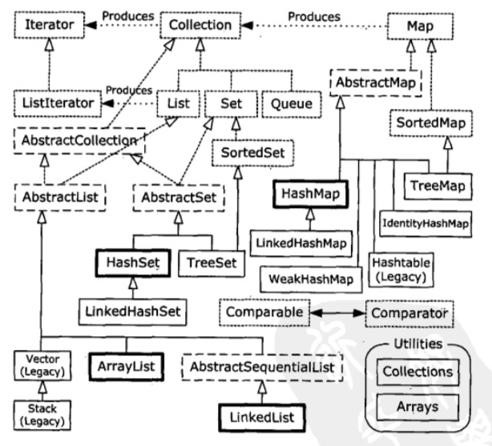

# 容器深入研究

## 17.1 完整的容器分类法

## 17.2 填充容器 
和Array一样，`Collections.fill`可以复制同一个对象引用来填充整个容器。
### 17.2.1 一种Generator解决方案

可以使用适配器模式实现一个接受`Generator`填充的容器
```java
public class CollecitonData<T> extends ArrayList<T>{
    public CollectionData(Generator<T> gen, int quantity){
        for(i = 0; i< quantity;i++)
            add(gen.next());
    }
}
```

### 17.2.2 Map生成器
可以用类似方法填充Map, 但是需要每次填充一个Pair, 或者使用两个生成器。

```java
public class Pair<K,V>{
    public final K key;
    public final V value;
    public Pair(K k, V v){
        key = k;
        value = v;
}

public class MapData<K, V> extends LinkedHashMap<K,V>{
    public CollectionData(Generator<Pair<K,V>> gen, int quantity){
        for(i = 0; i< quantity;i++)
            Pair<K,V> p = gen.next();
                put(p.key, p.value);
    }
}
```

### 17.2.3 使用Abstract类
使用AbsractMap然后实现需要的接口，可以实现只读等特殊要求的容器。使用`享元`还能减少空间存储需求(我感觉有点像python中魔术方法)。
```java
public class CountingIntegerList extends AbstractList<Integer> {
    private int size;
    public CountingIntegerList(int size){ // 构造器
        this.size = size<0?0:size;
    }
    public Integer get(int inex){ // get 方法。
        return Integer.valueOf(index);
    }
    public int size(){return size;} // 可以用来终止循环。
}
```

## 17.3 Colloection的功能方法
|方法 | 效果| 备注|
|:---:|:---:|:---:|
|添加|| |
|boolean add(Object obj)|添加一个元素| |
|boolean addAll(Collection c)|添加一个集合的元素|一定为true|
|删除功能|||
|void clear()|移除所有元素|
|boolean remove(Object o)|移除一个元素|
|boolean removeAll(Collection c)|移除一个集合的元素 | 调用的集合有变化返回true，否则返回false|
|判断功能|||
|boolean contains(Object o)|判断集合中是否包含指定的元素|
|boolean contaisAll(Collection c)|判断集合中是否包含指定的集合|
|boolean isEmpty()|判断集合是否为空|
|获取|||
|Iterator<E> iterator()|
|长度|||
|int size()|元素的个数| 
|交集|||
|boolean retainAll(Collection c)|调用集合内元素变为两个集合都有的元素 | 调用的集合有变化返回true，否则返回false|
|把集合转换为数组|
|Object[] toArray()|

## 17.4 可选操作


### 17.4.1 未获支持的操作
常见未获支持的操作，都源自背后固定尺寸的数据结构支持的容器。

## 17.5 List的功能方法
List的基本方法有添加`add`,取出`get`和`iterator`获得迭代器。LinkedList支持头尾插入操作。
## 17.6 Set的存储顺序
有如下四种set
- Set: 保证唯一和`Collection`的接口完全一样。容器内的元素需要实现`equals`方法。
- HashSet: 优化存储速度的`Set`。容器内的元素需要实现`hashCode`方法。
- TreeSet: 有序的`Set`。需要实现`compareTo`方法。
- LinkedHashSet: 有序又有查询速度的`Set`

### 17.6.1 SortedSet
排序后的`Set`。
拥有：
- first: 第一个元素。
- last: 最后一个元素。
- subSet: 从a,b 的所有元素的子集。
- headSet: 从头到b的所有元素的子集。
- tailSet: 从a到尾的所有元素的子集。
方法。

## 17.7 队列

除了并发队列只有`LinkedList`和`PriorityQueue`

### 17.7.1 优先队列
需要实现`compareTo`，优先队列属性按照比较顺序确定，其他队列按照插入顺序决定。

### 17.7.2 双向队列
不太实用，没有标准库需要自己实现。

## 17.8 理解Map
又叫`映射表`或者`关联数组`。两种基本方法`put`和`get`。

### 17.8.1 性能
`HashMap`使用了`HashCode`散列码来实现快速查询。

- HashMap: 默认选择，类似`Python`中的`Dict`。
- LinkedHashMap: 迭代访问更快，可以保留插入顺序，或者访问次数顺序。
- TreeMap: 基于红黑树, 会被排序。
- WeakedHashMap: 允许释放映射对象。
- ConcurrentHashMap: 线程安全的Map。多线程使用。
- IdentityHashMap: 使用 == 替代`equals`解决特殊问题。

基本操作包括，取所有key，取所有value，取单独值，一次更新多个值，查看key是否在Map里面，查看value是否在Map里面。

### 17.8.2 SortedMap

和`SortedSet`的方法一样，不过`first`和`last`变成了`firstKey`和`lastKey`。`subSet`,`headSet`,`tailSet`变成了`subMap`,`headMap`和`tailMap`。

### 17.8.3 LinkedHashMap 
可以使用LRU，最少访问优先。

## 17.9 散列与散列码
默认的散列码判断对象是否相等也是使用是否同一个对象。要使得具有相同值的对象可以正确用`key`查到。需要改写`hashcode`和`equals`。

### 17.9.1 理解hashCode()
本节用list实现了一个Map，但是速度堪忧。

### 17.9.2 为速度而散列
用散列码可以大大提高查询速度,本节讲散列码原理。

### 17.9.3 覆盖hashCode
本节说hashCode设计原则。

## 17.10 选择接口的不同实现
不要用`hashTable`，`Vector`, `Stack`。为了兼容老程序遗留的类。
如果经常删除了插入则用`LinkedList`否则用`ArrayList`。

### 17.10.1 性能测试框架
本节介绍性能测试的框架程序。

### 17.10.2 对List的选择
如果经常删除了插入则用`LinkedList`如果经常要读写本来存在的数据则用`ArrayList`。`Queue`适合两端插入删除。

### 17.10.3 微基准测试的危险

### 17.10.4 对Set的选择
`HashSet`总体比`TreeSet`快除了排序，只有在需要顺序时用`TreeSet`。如果经常要迭代可以选择`LinkedHashSet`

### 17.10.5 对Map的选择
正常用`HashMap`如果要求有序用`TreeMap`，迭代用`LinkedHashMap`。可以微调`HashMap`的性能因子达到更高的效率。`HashMap`的默认负载因子为0.75，超过后自动扩容。

## 17.11 实用方法

```java
public class Utilities {
	static List<String> list = Arrays.asList( "one Two three Four five six one".split(" "));
		  public static void main(String[] args) {
			 //打印这个集合
		    print(list);
		    //Collections.disjoint()当两个集合没有任何相同元素时返回 true
		    //Collections.singletonList(T x)产生不可变的 Set<T> List<T> 或 Map<K,V>只包含给定内容的单一项
		    print("'list' disjoint (Four)?: " +Collections.disjoint(list,Collections.singletonList("Four")));
		    //返回Collection 中最大和最小的元素
		    print("max: " + Collections.max(list));
		    print("min: " + Collections.min(list));
		    //采用后边的 String.CASE_INSENSITIVE_ORDER 比较方法返回最大和最小的元素，后边是一个 Comparator
		    print("max w/ comparator: " + Collections.max(list,String.CASE_INSENSITIVE_ORDER));
		    print("min w/ comparator: " + Collections.min(list,String.CASE_INSENSITIVE_ORDER));

		    List<String> sublist =Arrays.asList("Four five six".split(" "));
		    //返回 sublist 在 list 中第一次出现的位置，找不到返回 -1
		    print("indexOfSubList: " + Collections.indexOfSubList(list, sublist));
		    //返回 sublist 在 list 中最后一次出现的位置，找不到返回 -1
		    print("lastIndexOfSubList: " + Collections.lastIndexOfSubList(list, sublist));
		    //使用 Yo 替换掉 List 中所有的 one
		    Collections.replaceAll(list, "one", "Yo");
		    print("replaceAll: " + list);
		    //翻转所有的元素次序
		    Collections.reverse(list);
		    print("reverse: " + list);
		    //所有元素向后移动3个位置，末尾的元素循环到前面来
		    Collections.rotate(list, 3);
		    print("rotate: " + list);

		    List<String> source =Arrays.asList("in the matrix".split(" "));
		    //将 sourse 的元素复制到 list
		    Collections.copy(list, source);
		    print("copy: " + list);
		    //交换 list 中 位置 0 和 位置 list.size() - 1 的元素
		    Collections.swap(list, 0, list.size() - 1);
		    print("swap: " + list);
		    //随机改变列表的顺序
		    Collections.shuffle(list, new Random(47));
		    print("shuffled: " + list);
		    //用 pop 替换掉 list 中的所有元素
		    Collections.fill(list, "pop");
		    print("fill: " + list);
		    //返回 list 中 等于 pop 元素的个数
		    print("frequency of 'pop': " + Collections.frequency(list, "pop"));
		    //返回大小为 3 的 List<snap>
		    List<String> dups = Collections.nCopies(3, "snap");
		    print("dups: " + dups);

		    print("'list' disjoint 'dups'?: " +Collections.disjoint(list, dups));
		    // 为参数生成一个旧样式的 Enumeration<dups>
		    Enumeration<String> e = Collections.enumeration(dups);
		    Vector<String> v = new Vector<String>();
		    while(e.hasMoreElements())
		      v.addElement(e.nextElement());
		    // Converting an old-style Vector
		    // to a List via an Enumeration:
		    ArrayList<String> arrayList =Collections.list(v.elements());
		    print("arrayList: " + arrayList);
		  }
}

```

### 17.11.1 List 的排序与查询

List 的排序和查询所使用的的方法和对象数组多使用的方法有相同的名字和语法。

### 17.11.2 设定 Collection 或 Map 为不可修改
可以通过`Collection`中的方法创建不可变容器
```java
List<String> a = Collections.unmodifiableList(new ArrayList<String>(data));
Set<String> s = Collections.unmodifiableSet(new HashSet<String>(data));
Set<String> ss = Collections.unmodifiableSortedSet(new TreeSet<String>(data));
Map<String,String> m = Collections.unmodifiableMap(new HashMap<String,String>(FlyweightMap.capitals(6)));
Map<String,String> sm =Collections.unmodifiableSortedMap( new TreeMap<String,String>(FlyweightMap.capitals(6)));
```

 
### 17.11.3 Collection 或 Map 的同步控制
创建同步容器的方法也类似方法
```java
Collection<String> c =Collections.synchronizedCollection(new ArrayList<String>());
List<String> list = Collections.synchronizedList(new ArrayList<String>());
Set<String> s = Collections.synchronizedSet(new HashSet<String>());
Set<String> ss = Collections.synchronizedSortedSet(new TreeSet<String>());
Map<String,String> m = Collections.synchronizedMap(new HashMap<String,String>());
Map<String,String> sm =Collections.synchronizedSortedMap(new TreeMap<String,String>());
```

#### 快速报错
如果在迭代一个容器的同时，其他线程对其进行增加或者删除，保护机制会抛出迭代错误。这一点和Python中很像，对于`HashSet`和`HashDict`，修改可能导致`Hash`表重排，桶大小变化。这会导致无法知道什么迭代过了，什么内容还没有。

## 17.12 持有引用
三种引用
- SoftReference: 内存敏感的高速缓存
- WeakReference: 规范映射
- PhantomReference: 回收前状态。

### 17.12.1 WeakHashMap
用来保存WeakReference，这种映射中每个值只保存一份实例。

## 17.13 Java1.0/1.1的容器
已经过时了。不重要
### 17.13.1 Vector
### 17.13.2 HashTable
### 17.13.3 Stack
### 17.13.4 BitSet

## 17.14 总结
最重要的类库
